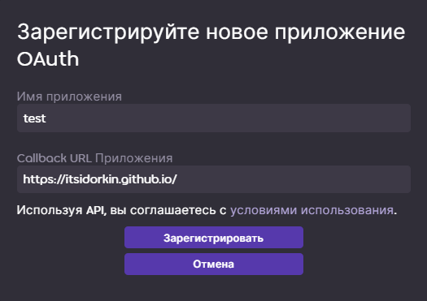

# [itsidorkin.github.io](https://itsidorkin.github.io)
Это сайт для редиректа. Его можно использовать для получения codе, который в свою очередь нужен чтобы получить access token и refresh token osu api v2. Сам по себе сайт бесполезен, но красив
# Где использовать

